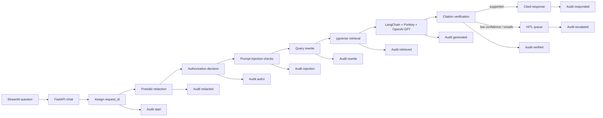

# Request flow

```mermaid
flowchart LR
    A[Streamlit question] --> B[FastAPI /chat]
    B --> C[Assign request_id]
    C --> D[Presidio redaction]
    D --> E[Authorization decision]
    E --> F[Prompt injection checks]
    F --> G[Query rewrite]
    G --> H[pgvector retrieval]
    H --> I[LangChain + Portkey + OpenAI GPT]
    I --> J[Citation verification]
    J -->|supported| K[Cited response]
    J -->|low confidence / unsafe| L[HITL queue]
    C --> M[Audit start]
    D --> N[Audit redacted]
    E --> O[Audit authz]
    F --> P[Audit injection]
    G --> Q[Audit rewrite]
    H --> R[Audit retrieved]
    I --> S[Audit generated]
    J --> T[Audit verified]
    K --> U[Audit responded]
    L --> V[Audit escalated]
```

That diagram is the contract. If the code path skips a box, the system is wrong.
